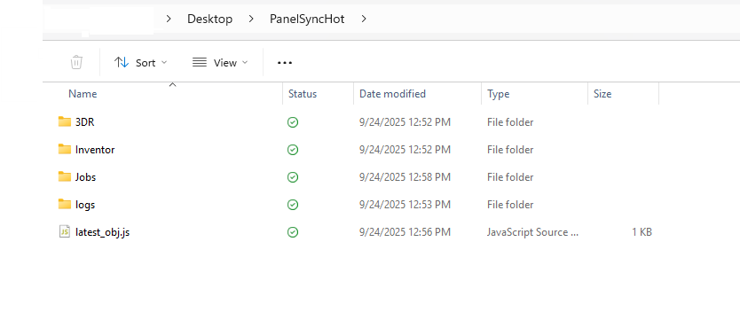
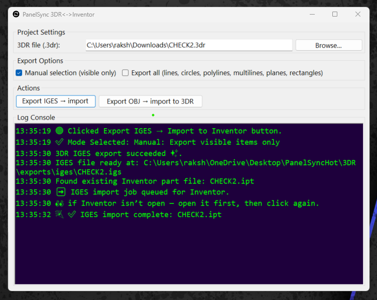
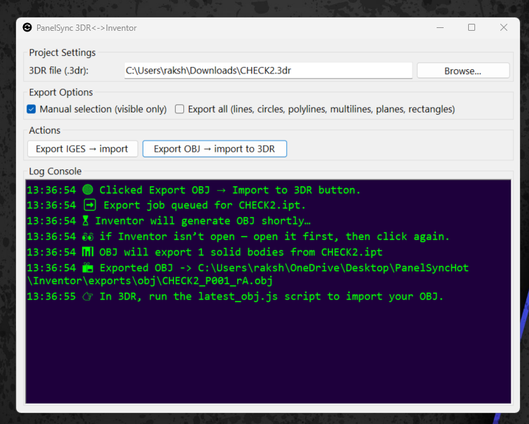
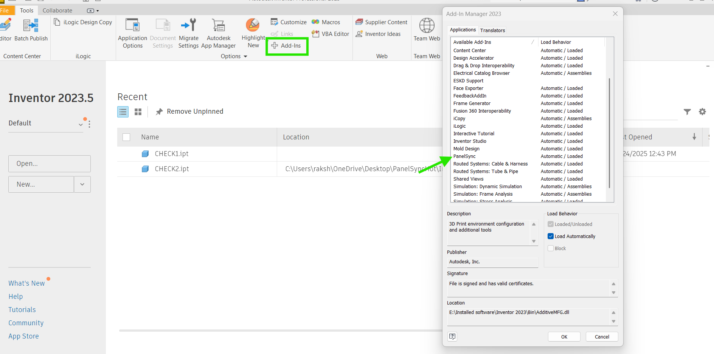
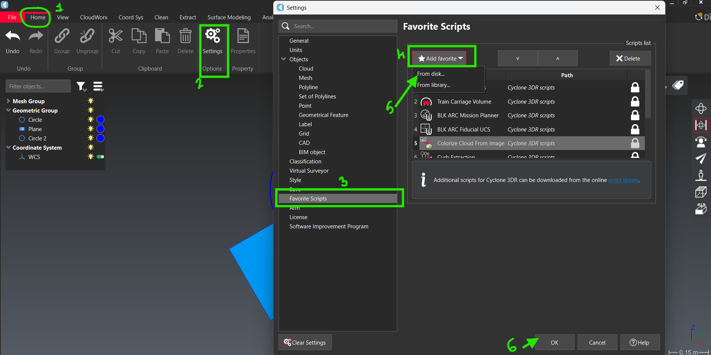
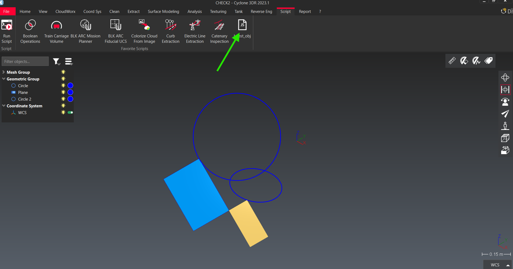
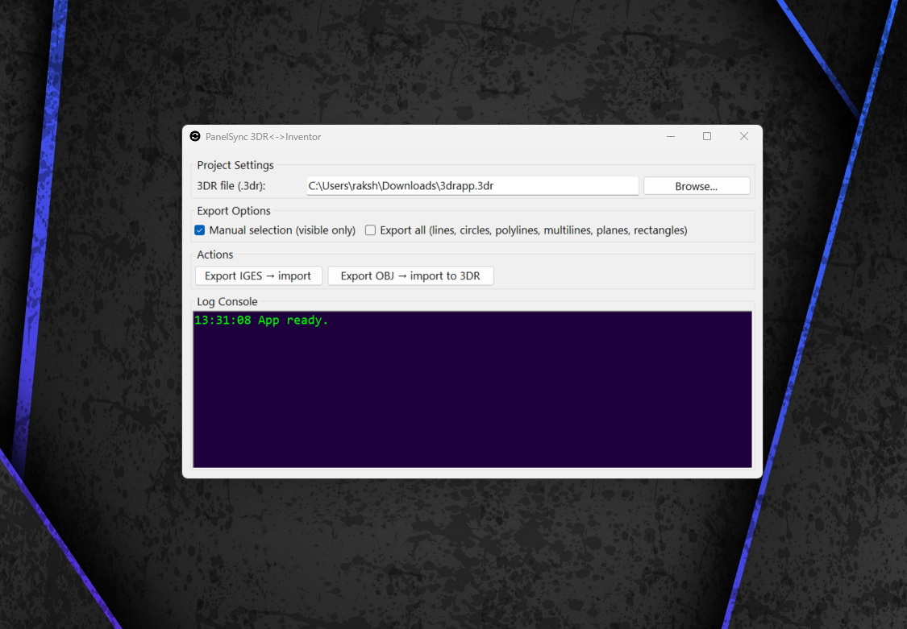
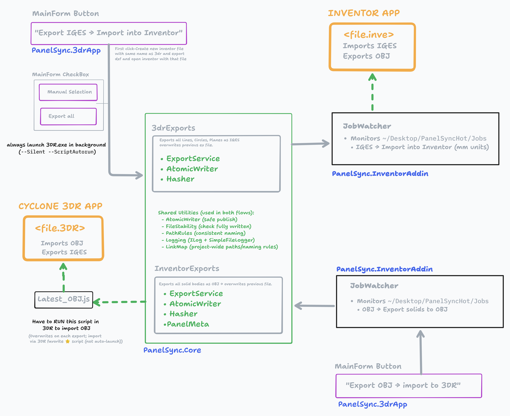

# PanelSync - 3DR ↔ Inventor Hot‑Folder Bridge

A tiny, reliable pipeline that lets Leica **Cyclone 3DR** and **Autodesk Inventor** trade geometry with almost no clicks.  
It uses a **hot‑folder** convention on your Desktop, an **Inventor add‑in** that watches for jobs, and a **WinForms helper app** for one‑click actions.

---

## ✨ What you can do

- **3DR → Inventor (IGES):** Export visible (or all) geometric objects from 3DR as IGES and import into a fresh/open IPT automatically.
- **Inventor → 3DR (OBJ):** Export the current IPT’s solid bodies to OBJ, then import **all meshes** into the active 3DR project via a generated script.
- **Zero‑tears file I/O:** Exports are atomic and watchers wait for “stable” files to avoid half‑written imports.
- **Single source of truth:** A `PanelSyncHot` folder on your **Desktop** keeps `Jobs`, `logs`, and `exports` in one place.

---

## 🗂 Folder map (auto‑created on first run)

```
~/Desktop/PanelSyncHot/
├─ 3DR/
│  └─ exports/
│     └─ iges/           # IGES files from 3DR
├─ Inventor/
│  └─ exports/
│     └─ obj/            # OBJ files from Inventor
├─ Jobs/                 # JSON job files for the Inventor add‑in
├─ logs/                 # Shared logs (3drapp.log, inventor-addin.log)
└─ latest_obj.js         # Auto‑generated import script for 3DR (You can add this as fav script in 3DR so OBJ import is just a clikc away)
```

> On some machines with OneDrive enabled, the path may be `C:\Users\<you>\OneDrive\Desktop\PanelSyncHot\…`

- `

---

## ⚙️ Prerequisites

- **Windows 10/11**
- **Autodesk Inventor** (2022+ recommended) with permission to load add‑ins
- **Leica Cyclone 3DR** (a build that supports `SPoly`, `SCADUtil`, `SComp`, scripting console, and command‑line `3DR.exe`)
- **Visual Studio 2022** (.NET Desktop workload)
- **.NET SDK 8.0+**

---

## 🚀 Quick start (TL;DR)

1. **Clone** this repo.
2. **Build & run** `PanelSync.3DRApp` (WinForms). It creates `~/Desktop/PanelSyncHot/…` and shows paths.
3. **Install the Inventor add‑in** (see next section). Start Inventor once to confirm it logs “Add‑in activated.”
4. **Pick your `.3dr` project** in the app (Browse…).
5. **IGES flow:** Click **“Export IGES → import to Inventor”** → an IPT is opened/created and IGES is imported.  
  - `
6. **OBJ flow:** Click **“Export OBJ → import to 3DR”** → OBJ is exported (overwriting previous), app writes `latest_obj.js`, then **run that script in 3DR** (from the scripting console/its easier if you add it as your favorite script in 3DR,explained in later section) to import **all meshes**.  
   - `

That’s it. Both directions are now one‑click (plus running the script in 3DR).

---

## 🧩 Install the Inventor add‑in

1. Build the solution so the Inventor add‑in assembly exists.
2. Create an `.addin` XML file (e.g., `PanelSync.InventorAddIn.addin`) in one of the Inventor add‑in folders, commonly:
   - `%APPDATA%\Autodesk\Inventor <version>\Addins\`
   - or `%PROGRAMDATA%\Autodesk\Inventor <version>\Addins\`

3. Use this template (update the `Assembly` path to your compiled DLL and keep the `Guid`):

```xml
<Addin Type="Standard">
      <DisplayName>PanelSync</DisplayName>
      <Description>Opens/creates IPT matching 3DR, imports latest DXF from PanelSyncHot jobs</Description>
      <Assembly>C:\Path\To\Your\Build\PanelSync.InventorAddIn.dll</Assembly>
      <ClassId>{B2C7C23E-18B0-4A11-9B0B-8C6B16E30F11}</ClassId>
      <FullClassName>PanelSync.InventorAddin.AddInServer</FullClassName>
      <LoadOnStartUp>1</LoadOnStartUp>
      <UserUnloadable>1</UserUnloadable>
      <Hidden>0</Hidden>
      <SupportedSoftwareVersionGreaterThan>24..</SupportedSoftwareVersionGreaterThan>
      <DataVersion>1</DataVersion>
      <UserInterfaceVersion>1</UserInterfaceVersion>
</Addin>
```

4. Start Inventor→ go to add-in manger → check if PanelSync is added
- `

---
## 📜 Add `latest_obj.js` as a Favorite Script in 3DR

This ensures the OBJ import script is always ready in 3DR — no browsing each time.

- `

1. Open **Cyclone 3DR**.  
2. Go to **Home → Settings → Favorite Script**.  
3. Click **Add Favorite → From Disk…**.  
4. Browse to your Desktop hot-folder path (it may be under OneDrive on some setups):

   ```
   C:\Users\<YourUserName>\Desktop\PanelSyncHot\latest_obj.js
   ```
   or simply look inside your **PanelSyncHot** folder on the Desktop.

5. Select the file and click **OK**.  
   ✅ The favorite script is now saved.

>- `

From now on:
- Every time you open 3DR, the favorite is already loaded.  
- After you export OBJ from Inventor, just click the ⭐ **PanelSync Import OBJ** favorite inside 3DR to run the script and import all meshes.

---

## 🖥️ Using the WinForms app

>- `

### Fields
- **3DR file (.3dr):** path to the project you want to use for IGES export and OBJ import.

### Options
- **Manual selection (visible only):** exports only what’s visible in 3DR.
- **Export all (lines, circles, polylines, multilines, planes, rectangles):** exports everything matching the built‑in filter.

### Actions
- **Export IGES → import to Inventor**
  1. App triggers a 3DR script to export IGES to the hot‑folder.
  2. It queues an **IGES job**; the Inventor add‑in opens/creates an IPT, forces **mm units**, imports the IGES, saves, and activates the document.
  3. Watch the status text turn into a 🎉 success line in the app when the add‑in logs completion.

- **Export OBJ → import to 3DR**
  1. App queues an **OBJ job** for the IPT named after your `.3dr` file.
  2. Add‑in exports **all solid bodies** to `Inventor/exports/obj/<Base>_P001_rA.obj`, **overwriting** any previous file.
  3. App detects the new OBJ and writes `~/Desktop/PanelSyncHot/latest_obj.js` which imports **all meshes** from the OBJ into 3DR.
  4. Open 3DR and run `latest_obj.js` in the scripting console.

---

## 🔧 Configuration

The app stores settings in:

```
%APPDATA%\PanelSync\3DRApp\appsettings.json
```

You can customize:
- `InventorExportObj` (OBJ output folder),
- `ThreeDRExportIges` (IGES output folder),
- `InventorProjects` (where the IPT is created/located),
- `LogsRoot`,
- and the `ThreeDRFilePath` you last used.

> First run creates sensible defaults under `~/Desktop/PanelSyncHot/…`.

---

## 🔒 Reliability details (for devs)

- **Atomic writes:** files are written to a temp path then swapped in; consumers never read partial files.
- **Stability gate:** watchers wait until a file stops changing and can be opened exclusively before acting.
- **Add‑in job model:** a JSON job in `~/Desktop/PanelSyncHot/Jobs` triggers either **IGES import** or **OBJ export**.
- **Log bridge:** the 3DR app tails `inventor-addin.log` and surfaces milestones in‑app.

---

## 📐 Units

- IGES import into Inventor explicitly sets **document units to millimeters (mm)** before adding the imported component.
- If 3DR geometry scale looks off, ensure your 3DR project is in mm or apply a scale matrix in the IGES export script (a hook is present).

---

## 🪪 Troubleshooting

- **Nothing happens on IGES:** confirm the Inventor add‑in is loaded and check `logs/inventor-addin.log`.
- **OBJ not created:** make sure the target IPT is open and contains **solid bodies** (surfaces alone won’t export as OBJ).
- **3DR didn’t import anything:** run `latest_obj.js` manually in 3DR; if it errors, verify the OBJ path inside the script.
- **Paths look wrong:** check `%APPDATA%\PanelSync\3DRApp\appsettings.json` and the Desktop hot‑folder paths.
- **Everytime you solve issue** tell how you here(or write to me) so it's helpful to all

---

## 🗺️ Conceptual workflow

>- `
---

## 📄 License

MIT (or your preferred license).

